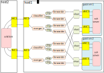

# SPP_VF Sample Usage

This sample demonstrates an use-case of MAC address classification of
spp_vf.
It enables to access to VMs with ssh from a remote node.

Before trying this sample, install SPP by following
[setup guide](setup_guide.md).



## Testing Steps

In this section, you configure spp_vf and client applications for
this use-case.


### Setup SPP

First, launch spp controller and primary process.

  ```sh
  $ pwd
  /path/to/Soft-Patch-Panel

  # SPP controller
  $ python ./src/spp.py -p 5555 -s 6666

  # SPP primary
  $ sudo ./src/primary/x86_64-native-linuxapp-gcc/spp_primary \
  -c 0x02 -n 4 --socket-mem 512,512 --huge-dir=/run/hugepages/kvm \
  --proc-type=primary \
  -- \
  -p 0x03 -n 8 -s 127.0.0.1:5555
  ```

TODO(yasufum) add description for sec.

  ```sh
  # start nc for secondary 1
  $ while true; do nc -l 11111; done

  # start secondary 1
  $ sudo ./src/vf/x86_64-native-linuxapp-gcc/spp_vf \
  -c 0x00fd -n 4 --proc-type=secondary \
  -- \
  --process-id 1 \
  --config /path/to/spp_vf1_without_cmtab.json \
  -s 127.0.0.1:11111

  # start nc for secondary 2
  $ while true; do nc -l 11112; done

  # start secondary 2
  $ sudo ./src/vf/x86_64-native-linuxapp-gcc/spp_vf \
  -c 0x3f01 -n 4 --proc-type=secondary \
  -- \
  --process-id 2 \
  --config /path/to/spp_vf2_without_cmtab.json \
  -s 127.0.0.1:11112
  ```

### Setup network configuration for VMs

Start two VMs.

  ```sh
  $ virsh start spp-vm1
  $ virsh start spp-vm2
  ```

Login to spp-vm1 for network configuration.
To not ask for unknown keys while login VMs,
set `-oStrictHostKeyChecking=no` option for ssh.

  ```sh
  $ ssh -oStrictHostKeyChecking=no sppuser@192.168.122.31
  ```

Up interfaces for vhost and register them to arp table inside spp-vm1.
In addition, you have to disable TCP offload function, or ssh is faled
after configuration is done.

  ```sh
  # up interfaces
  $ sudo ifconfig ens4 inet 192.168.140.21 netmask 255.255.255.0 up
  $ sudo ifconfig ens5 inet 192.168.150.22 netmask 255.255.255.0 up

  # register to arp table
  $ sudo arp -s 192.168.140.11 a0:36:9f:78:86:78 -i ens4
  $ sudo arp -s 192.168.150.13 a0:36:9f:6c:ed:bc -i ens5

  # diable TCP offload
  $ sudo ethtool -K ens4 tx off
  $ sudo ethtool -K ens5 tx off
  ```

Configurations for spp-vm2 is same as spp-vm1.

  ```sh
  $ ssh -oStrictHostKeyChecking=no sppuser@192.168.122.32

  # up interfaces
  $ sudo ifconfig ens4 inet 192.168.140.31 netmask 255.255.255.0 up
  $ sudo ifconfig ens5 inet 192.168.150.32 netmask 255.255.255.0 up

  # register to arp table
  $ sudo arp -s 192.168.140.11 a0:36:9f:78:86:78 -i ens4
  $ sudo arp -s 192.168.150.13 a0:36:9f:6c:ed:bc -i ens5

  # diable TCP offload
  $ sudo ethtool -K ens4 tx off
  $ sudo ethtool -K ens5 tx off
  ```

Check the configuration by trying ssh from remote machine that
connection is accepted but discarded in spp secondary.
If you do ssh for VM1, you find a messages from spp secondary for
discarding packets.

## Test Application

TODO(yasufum) json-based steps are deprecated.

### Register MAC address to Classifier

Register MAC addresses to classifier.

  ```sh
  {
    "commands": [
      {
        "command": "classifier_table",
        "type": "mac",
        "value": "52:54:00:12:34:56",
        "port": "ring0"
      },
      {
        "command": "classifier_table",
        "type": "mac",
        "value": "52:54:00:12:34:58",
        "port": "ring1"
      },
      {
        "command": "flush"
      }
    ]
  }
  ```

  ```sh
  {
    "commands": [
      {
        "command": "classifier_table",
        "type": "mac",
        "value": "52:54:00:12:34:57",
        "port": "ring4"
      },
      {
                    "command": "flush"
      }
    ]
  }
  ```

### Login to VMs

Now, you can login VMs.

  ```sh
  # spp-vm1 via NIC0
  $ ssh sppuser@192.168.140.21

  # spp-vm1 via NIC1
  $ ssh sppuser@192.168.150.22

  # spp-vm2 via NIC0
  $ ssh sppuser@192.168.140.31

  # spp-vm2 via NIC1
  $ ssh sppuser@192.168.150.32
  ```

If you unregister the addresses, send request as following.

  ```sh
  {
    "commands": [
      {
        "command": "classifier_table",
        "type": "mac",
        "value": "52:54:00:12:34:58",
        "port": "unuse"
      },
      {
        "command": "flush"
      }
    ]
  }
  ```
